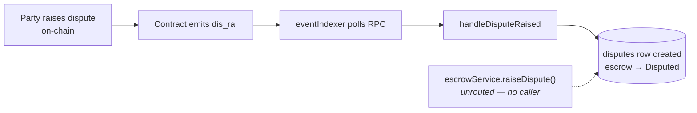
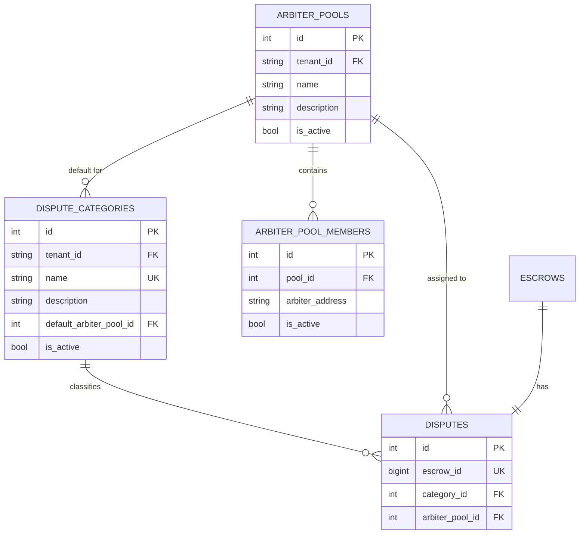
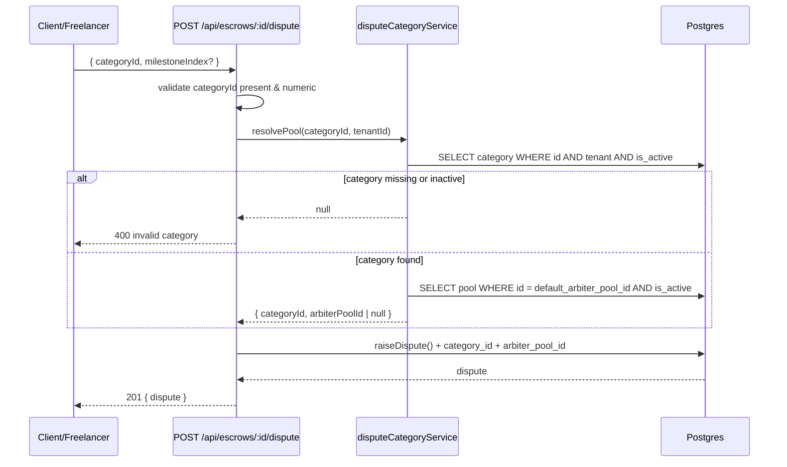

# Dispute Categories and Arbiter Pools

> **Status: proposed — not implemented.**
> This is a design specification for [issue #218](https://github.com/KCEE0901/trustchain-escrow/issues/218).
> Nothing described under [Proposed design](#proposed-design) exists in the codebase yet.
> Everything under [Current state](#current-state) is verified against the code as it
> stands today. Do not read the endpoint tables as an API reference until this ships.

**Audience:** backend contributors implementing #218, and reviewers assessing it.

Related reading:

- [docs/arbiter-guide.md](arbiter-guide.md) — how arbiters are assigned and what they can do today
- [docs/milestone-state-machine.md](milestone-state-machine.md) — dispute states in the escrow lifecycle
- [docs/event-schema.md](event-schema.md) — the on-chain `dis_rai` / `dis_res` events
- [docs/api-reference.md](api-reference.md) — authentication model for the endpoints below

---

## Table of contents

- [Why categories](#why-categories)
- [Current state](#current-state)
- [Proposed design](#proposed-design)
  - [Data model](#data-model)
  - [Seed categories](#seed-categories)
  - [Assignment flow](#assignment-flow)
- [API](#api)
  - [Public: list categories](#public-list-categories)
  - [Creating a categorised dispute](#creating-a-categorised-dispute)
  - [Admin: category CRUD](#admin-category-crud)
- [Migration plan](#migration-plan)
- [Test plan](#test-plan)
- [Open decisions](#open-decisions)
- [Out of scope](#out-of-scope)

---

## Why categories

Disputes are currently untyped: a `disputes` row records who raised it and when, but
nothing about what kind of disagreement it is. Two consequences:

1. **Routing is manual.** Every dispute lands in the same undifferentiated queue, so
   an arbiter with payments expertise is as likely to pick up a scope disagreement as
   a payment-delay case.
2. **Analytics are blind.** There is no way to answer "which failure mode drives most
   disputes" without reading free-text evidence.

Categorising at creation time fixes both: it gives the platform a routing key and a
grouping dimension, at the cost of one required field on the dispute-creation path.

---

## Current state

Verified against the code at time of writing. This section is the important one for
anyone estimating #218 — several things the issue assumes already exist do not.

### What exists

| Thing | Where | Notes |
| ----- | ----- | ----- |
| `disputes` table | [schema.prisma:321](../backend/database/schema.prisma#L321) | `id`, `tenantId`, `escrowId` (unique), `raisedByAddress`, `raisedAt`, `resolvedAt`, amounts, `resolvedBy`, `resolution`, `resolutionType`, `autoResolved` |
| Dispute read/evidence/appeal API | [disputeRoutes.js](../backend/api/routes/disputeRoutes.js) | Mounted at `/api/disputes`, all routes behind `authMiddleware` |
| `Arbitrator` role | [roleGuard.js](../backend/api/middleware/roleGuard.js) | Permissions: `resolve_dispute`, `view_dispute`, `view_own_escrow` |
| Per-escrow arbiter | [schema.prisma:203](../backend/database/schema.prisma#L203) | `Escrow.arbiterAddress` — a single nullable address |
| Admin auth | [adminAuth.js](../backend/api/middleware/adminAuth.js) | Bearer admin token (preferred) or `x-admin-api-key` |
| Dispute creation service | [escrowService.js:90](../backend/services/escrowService.js#L90) | `raiseDispute()` — **exists but is wired to no HTTP route** |
| Indexer dispute creation | [eventIndexer.js](../backend/services/eventIndexer.js) | `handleDisputeRaised` upserts a dispute row from the on-chain `dis_rai` event |

### What does not exist

These gaps are what make #218 larger than its checklist suggests:

| Assumed by the issue | Reality |
| -------------------- | ------- |
| **An arbiter pool concept** | There is no pool table, model, service, or membership anywhere in the repo. `default_arbiter_pool_id` would point at something that has to be built first. |
| **`POST /api/v1/disputes`** | No dispute-creation endpoint exists. Disputes enter the database from the indexer, driven by the on-chain `dis_rai` event. `escrowService.raiseDispute()` is unrouted code. |
| **`/api/v1/` path prefix** | Routes mount at `/api/*` ([server.js:199-202](../backend/server.js#L199-L202)). The only `/v1/` reference is a deprecation example. This spec uses `/api/*` to match the codebase. |

### Where disputes come from today



The dashed path matters: the service function needed for an HTTP dispute-creation
endpoint is already written and tested-adjacent, but nothing calls it. Wiring it up is
a prerequisite for the issue's `category_id`-on-create requirement.

**This is the central design tension.** Disputes are authoritatively created on-chain,
where there is no notion of a category. Any category assigned through the API is
off-chain metadata that decorates a row the indexer may create independently. The
design below resolves this by making the API path an *enrichment* of a dispute the
chain owns, rather than a competing source of truth.

---

## Proposed design

### Data model



#### `dispute_categories`

| Column | Type | Constraints | Notes |
| ------ | ---- | ----------- | ----- |
| `id` | `SERIAL` | PK | |
| `tenant_id` | `TEXT` | NOT NULL, FK → `tenants(id)` ON DELETE CASCADE | Every domain table in this schema is tenant-scoped; categories must be too, so a tenant can define its own taxonomy |
| `name` | `TEXT` | NOT NULL, UNIQUE per tenant | e.g. `Non-Delivery` |
| `description` | `TEXT` | NULL | Shown in the category picker |
| `default_arbiter_pool_id` | `INT` | NULL, FK → `arbiter_pools(id)` ON DELETE SET NULL | Nullable so a category can exist before its pool is staffed |
| `is_active` | `BOOLEAN` | NOT NULL DEFAULT TRUE | Soft delete — see [Open decisions](#open-decisions) |
| `created_at` / `updated_at` | `TIMESTAMPTZ` | NOT NULL DEFAULT NOW() | |

Index on `(tenant_id, is_active)` for the public list, and a unique index on
`(tenant_id, name)`.

#### `arbiter_pools` and `arbiter_pool_members`

The issue names `default_arbiter_pool_id` without defining a pool, so this spec
defines the minimum that makes the reference meaningful.

`arbiter_pools`: `id`, `tenant_id` (FK), `name`, `description`, `is_active`,
timestamps. Unique on `(tenant_id, name)`.

`arbiter_pool_members`: `id`, `pool_id` (FK, CASCADE), `arbiter_address`, `is_active`,
`created_at`. Unique on `(pool_id, arbiter_address)`.

`arbiter_address` is a Stellar address matching `^G[A-Z2-7]{55}$`, consistent with
[`stellarAddressBody`](../backend/middleware/validation.js). It is deliberately **not**
a foreign key to `user_profiles` — an arbiter may be added to a pool before they have
ever logged in.

#### `disputes` additions

| Column | Type | Constraints |
| ------ | ---- | ----------- |
| `category_id` | `INT` | NULL, FK → `dispute_categories(id)` ON DELETE SET NULL |
| `arbiter_pool_id` | `INT` | NULL, FK → `arbiter_pools(id)` ON DELETE SET NULL |

Both are nullable. This is not optional: existing dispute rows have no category, and
the indexer creates disputes from on-chain events that carry none. A `NOT NULL`
column would break the indexer on the first dispute after deploy. "Category required"
is enforced at the **API boundary**, not by the schema — see
[Open decisions](#open-decisions).

`arbiter_pool_id` is denormalised onto the dispute rather than always resolved through
the category, so that re-pointing a category's default pool later does not silently
rewrite the routing of disputes already in flight.

### Seed categories

Seeded per tenant on migration, matching the issue:

| Name | Description |
| ---- | ----------- |
| `Non-Delivery` | Work was never delivered, or delivery stopped partway |
| `Quality Issue` | Work was delivered but does not meet the agreed standard |
| `Scope Dispute` | Disagreement over what the agreed deliverable actually covers |
| `Payment Delay` | Funds were not released after an approved milestone |
| `Other` | Anything that does not fit the categories above |

Seeding is idempotent (`ON CONFLICT (tenant_id, name) DO NOTHING`) so re-running the
migration or adding a tenant later is safe. `default_arbiter_pool_id` is left `NULL`
at seed time — pools are operator-configured, and guessing them would route real
disputes to an empty pool.

### Assignment flow



Resolution rules:

| Situation | Behaviour |
| --------- | --------- |
| Category exists, has an active default pool | `arbiter_pool_id` set to that pool |
| Category exists, `default_arbiter_pool_id` is `NULL` | Dispute created with `arbiter_pool_id = NULL`; logged at `warn` for operator visibility |
| Category exists, default pool exists but is inactive | Treated as unassigned — `NULL`, warn |
| Category id unknown, inactive, or belongs to another tenant | `400`, dispute **not** created |
| Category id omitted | `400`, dispute **not** created |

Pool resolution happens **inside the same transaction** as dispute creation. Resolving
first and writing after leaves a window where the category is deactivated between the
two, producing a dispute pointing at a pool the operator just retired.

Assignment stops at the pool. Selecting an individual arbiter from a pool
(round-robin, least-loaded, reputation-weighted) is deliberately
[out of scope](#out-of-scope) — the issue asks to "auto-assign arbiter pool", and
picking a person raises fairness and availability questions worth their own issue.

---

## API

All paths are `/api/*`, matching the current mount points. Standard error shape
throughout: `{ "error": "<message>" }`, consistent with the existing dispute and
webhook controllers.

### Public: list categories

```http
GET /api/dispute-categories
```

Unauthenticated. Add to `PUBLIC_ROUTES` in
[gateway/index.js](../backend/gateway/index.js) — otherwise the gateway's JWT check
rejects it before it reaches the router.

Returns active categories for the resolved tenant, ordered by name.

```json
{
  "data": [
    {
      "id": 1,
      "name": "Non-Delivery",
      "description": "Work was never delivered, or delivery stopped partway"
    },
    {
      "id": 3,
      "name": "Other",
      "description": "Anything that does not fit the categories above"
    }
  ]
}
```

`default_arbiter_pool_id` is **omitted from the public response**. Pool topology is
operational detail; exposing which pool handles which category tells an adversary
which arbiters to target. Admins see it via the admin endpoint.

Cacheable with `cacheResponse({ ttl: TTL.STATIC, tags: ['dispute-categories'] })` —
this list changes rarely. Admin mutations must `invalidateOn` the same tag.

### Creating a categorised dispute

The issue specifies `POST /api/v1/disputes`. No such endpoint exists, and disputes are
keyed one-to-one on `escrow_id` (`@unique`), so the resource is naturally nested:

```http
POST /api/escrows/:escrowId/dispute
Authorization: Bearer <jwt>
```

```json
{
  "categoryId": 1,
  "milestoneIndex": 2
}
```

This wires up the existing unrouted
[`escrowService.raiseDispute()`](../backend/services/escrowService.js#L90), extended to
accept and persist `categoryId` and the resolved `arbiterPoolId`.

`201 Created`:

```json
{
  "data": {
    "id": 17,
    "escrowId": "42",
    "raisedByAddress": "GA7QYNF7SOWQ3GLR2BGMZEHXAVIRZA4KVWLTJJFC7MGXUA74P7UJVSGZ",
    "raisedAt": "2026-07-25T10:14:55.000Z",
    "categoryId": 1,
    "arbiterPoolId": 4
  }
}
```

| Status | Condition |
| ------ | --------- |
| `400` | `categoryId` missing, non-numeric, unknown, inactive, or another tenant's |
| `403` | Caller is neither the escrow's client nor its freelancer |
| `404` | Escrow does not exist |
| `409` | Escrow is not `Active`, or a dispute already exists for it |

Guard with `checkPermission(ROLES.CLIENT, 'raise_dispute')` — both `Client` and
`Freelancer` already hold `raise_dispute` in the
[permission map](../backend/api/middleware/roleGuard.js).

> **Chain reconciliation.** This endpoint records a dispute off-chain; the on-chain
> `dis_rai` event is what the contract acts on. `handleDisputeRaised` already upserts
> rather than inserts, so an API-created dispute is enriched, not duplicated, when the
> event lands — **provided the upsert's `update` branch does not clear `category_id`**.
> It currently passes `update: {}`, which is correct here and must stay that way.

### Admin: category CRUD

Mounted under the existing admin router, so `adminAuth` applies automatically.

| Method | Path | Purpose |
| ------ | ---- | ------- |
| `GET` | `/api/admin/dispute-categories` | List all categories, including inactive, with pool details |
| `POST` | `/api/admin/dispute-categories` | Create a category |
| `PATCH` | `/api/admin/dispute-categories/:id` | Update name, description, default pool, or active flag |
| `DELETE` | `/api/admin/dispute-categories/:id` | Deactivate (soft delete) |

`POST` body:

```json
{
  "name": "Intellectual Property",
  "description": "Ownership or licensing disagreement over delivered work",
  "defaultArbiterPoolId": 4
}
```

Validation:

| Field | Rule |
| ----- | ---- |
| `name` | Required, 1–64 chars, trimmed, unique per tenant → `409` on collision |
| `description` | Optional, ≤ 500 chars |
| `defaultArbiterPoolId` | Optional; must reference an existing pool in the same tenant → `400` |
| `isActive` | Optional boolean, `PATCH` only |

`DELETE` sets `is_active = false` rather than removing the row. A hard delete would
orphan the `category_id` on historical disputes, destroying exactly the analytics the
categories exist to enable. Deactivated categories disappear from the public list and
are rejected on dispute creation, but remain readable on existing disputes.

Every mutation writes an `adminAuditLog` row (`DISPUTE_CATEGORY_CREATED`,
`_UPDATED`, `_DEACTIVATED`), matching how other admin mutations are recorded.

---

## Migration plan

New migration `backend/database/migrations/<timestamp>_dispute_categories.js`,
following the existing `up(prisma)` / `down(prisma)` + `$executeRawUnsafe` convention
(see [the reputation-events migration](../backend/database/migrations/20260620000000_add_reputation_events.js)).

`up()` order matters — pools must exist before categories can reference them:

1. `CREATE TABLE IF NOT EXISTS arbiter_pools`
2. `CREATE TABLE IF NOT EXISTS arbiter_pool_members`
3. `CREATE TABLE IF NOT EXISTS dispute_categories` (FK → `arbiter_pools`)
4. `ALTER TABLE disputes ADD COLUMN IF NOT EXISTS category_id INT`, plus FK
5. `ALTER TABLE disputes ADD COLUMN IF NOT EXISTS arbiter_pool_id INT`, plus FK
6. Indexes
7. Seed the five categories per existing tenant, `ON CONFLICT DO NOTHING`

`down()` reverses: drop the two dispute columns, then the three tables.

The migration is **additive and backward compatible** — both new dispute columns are
nullable, so a running instance on the previous release keeps working against the
migrated schema. Deploy the migration before the code.

`schema.prisma` needs matching `DisputeCategory`, `ArbiterPool`, and
`ArbiterPoolMember` models, the two new `Dispute` fields, and back-relations on
`Tenant`. Run `npm run db:generate -w backend` after editing.

---

## Test plan

Jest with `unstable_mockModule` against a mocked Prisma client and supertest for
routes, matching [disputeValidation.test.js](../backend/tests/disputeValidation.test.js).
Suggested file: `backend/tests/disputeCategories.test.js`.

**Category required**

- `POST` dispute with no `categoryId` → `400`, no write attempted
- `categoryId` non-numeric → `400`
- Unknown `categoryId` → `400`
- Inactive category → `400`
- Category belonging to another tenant → `400`, and the message must not confirm the id exists

**Auto-assign pool**

- Category with an active default pool → dispute persisted with that `arbiterPoolId`
- Category with `default_arbiter_pool_id = NULL` → dispute created, `arbiterPoolId` null, warn logged
- Category whose default pool is inactive → treated as unassigned
- Pool resolution and dispute insert occur in one transaction

**Public list**

- Returns only active categories for the tenant
- Response omits `defaultArbiterPoolId`
- Reachable without a JWT

**Admin CRUD**

- Requests without admin auth → `401`
- Create → `201`; duplicate name in the same tenant → `409`; same name in a different tenant → `201`
- `PATCH` updates fields; `defaultArbiterPoolId` pointing at another tenant's pool → `400`
- `DELETE` sets `is_active = false` and leaves the row; the category vanishes from the public list but stays readable on existing disputes
- Each mutation writes an `adminAuditLog` row

**Regression**

- `handleDisputeRaised` upserting over an API-created dispute preserves `category_id`

---

## Open decisions

Worth settling in review before implementation starts.

| # | Decision | Options | Recommendation |
| - | -------- | ------- | -------------- |
| 1 | Where "category required" is enforced | Schema `NOT NULL` vs. API-only validation | **API-only.** The indexer creates disputes from on-chain events with no category; a `NOT NULL` column breaks it outright. |
| 2 | Endpoint shape for creation | `POST /api/disputes` vs. `POST /api/escrows/:id/dispute` | **Nested.** `escrow_id` is `@unique` on `disputes`, so the dispute is a singleton sub-resource of an escrow. |
| 3 | Path versioning | Introduce `/api/v1/` vs. match `/api/` | **Match `/api/`.** Versioning the whole surface is a separate migration; doing it for one feature fragments the API. |
| 4 | Pool membership scope | Full pool + member tables vs. pools as a bare lookup | **Full.** A pool with no members cannot route anything, making the feature untestable end to end. |
| 5 | Category taxonomy scope | Global vs. per-tenant | **Per-tenant.** Every other domain table is tenant-scoped; a global taxonomy would be the only exception. |
| 6 | Backfill of existing disputes | Leave `NULL` vs. backfill to `Other` | **Leave `NULL`.** `Other` is a real user choice; using it as a backfill value corrupts the analytics the feature exists for. Distinguish "uncategorised" from "categorised as Other". |

---

## Out of scope

Deliberately excluded, each worth its own issue:

- **Individual arbiter selection from a pool.** Round-robin, least-loaded, or
  reputation-weighted assignment, plus availability and recusal handling.
- **Arbiter pool management API.** This spec defines the pool tables because
  `default_arbiter_pool_id` is meaningless without them, but admin CRUD for pools and
  their membership is not covered.
- **On-chain category representation.** Categories stay off-chain metadata. Putting
  them on-chain means a contract change and a new event topic.
- **Category analytics endpoints.** The schema makes "disputes by category" queryable;
  no reporting endpoint is specified.
- **Frontend category picker.** The dispute-raising UI needs a selector fed by
  `GET /api/dispute-categories`.
- **Re-categorisation.** Changing a dispute's category after creation, and whether
  that should re-run pool assignment.
